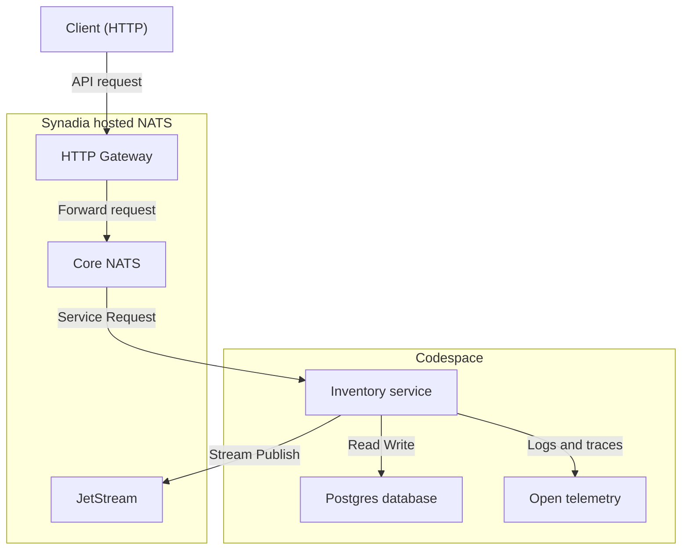

# Overview

Beaker is a demonstration project that shows how to build a production-ready microservice architecture using [NATS](https://nats.io/). It includes structured request handling, streaming support, service discovery, health checks, and observability features, giving teams a practical foundation for building scalable systems.

# High-Level Architecture

The system uses a modular microservice approach with NATS as the communication backbone. Each service registers itself using NATS Microservices API and communicates asynchronously via JetStream or synchronously through service requests.

# Goals

- Demonstrate a working NATS microservice with real-world patterns.
- Support request/response and streaming message patterns.
- Provide observability hooks for health checks and metrics.
- Showcase service discovery and modular composition.
- Enable developer-friendly local development via Codespaces and devcontainers.

