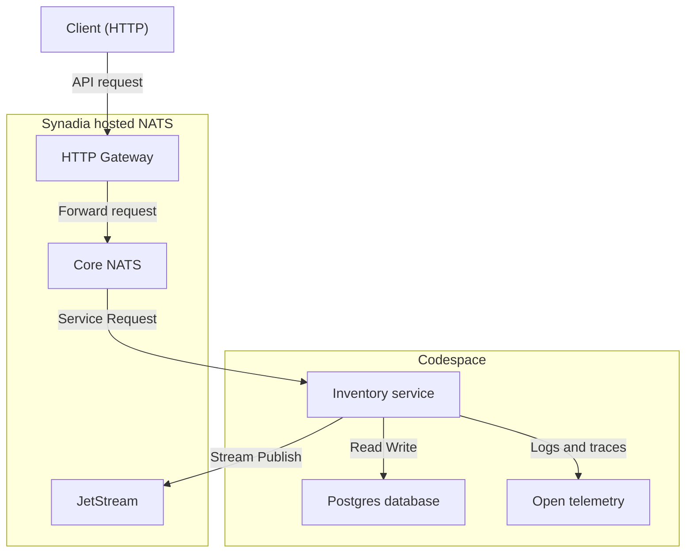
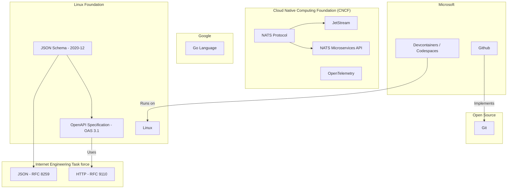

# Overview

Beaker is a demonstration project that shows how to build a production-ready microservice architecture using [NATS](https://nats.io/). It includes structured request handling, streaming support, service discovery, health checks, and observability features, giving teams a practical foundation for building scalable systems.

# Project Goals

- Showcase the components needed to build and run a modern production quality microservice.
- Build our system in [`go`](https://go.dev/) using the [NATS service](https://docs.nats.io/using-nats/developer/services) protocol, and a [Postgres](https://www.postgresql.org/) database.
- Discuss use of standards, and how they help guide our development.
- Demonstrate tooling used to help accelerate developer productivity when building with these tools
- Provide observability hooks for health checks and metrics.
- Show best practice developer-friendly local development via Github Codespaces and devcontainers.

# High-Level Architecture

The system uses a modular microservice approach with NATS as the communication backbone. Each service registers itself using NATS Microservices API and communicates asynchronously via JetStream or synchronously through service requests.

#  System Goals

We are building a basic **Inventory API** that tracks the quantity of products using their unique `product-sku`. The API allows clients to:

- Add stock
- Remove stock
- Query the current stock level

##  Business Rules

- Every product is uniquely identified by a `product-sku`.
- Inventory levels **cannot fall below 0** — we must never sell stock we don’t have.

## API Endpoints

### `inventory-receive`

- Accepts a `product-sku` and a `quantity`.
- If the product doesn’t exist, it is created with a starting quantity of 0.
- The `quantity` is added to the current stock.
- ❌ Rejects if the quantity is `<= 0`.

### `inventory-drawdown`

- Accepts a `product-sku` and a `quantity`.
- If the product doesn’t exist, it is created with a starting quantity of 0.
- The `quantity` is subtracted from the current stock.
- ❌ Rejects if the result would reduce inventory below 0.

### `inventory-show`

- Accepts a `product-sku`.
- Returns the current quantity in stock.
- If the product doesn’t exist, returns `0`.

## Technical Requirements

- The API must be accessible via:
  - HTTP
  - NATS
- All requests and responses use [JSON](https://www.json.org/json-en.html).
  - Use [JSON Schema](https://json-schema.org/) to validate requests & responses
- Define our API using the [OpenAPI](https://www.openapis.org/) standard.
- Implement tests to verify that our code is working correctly.

# Standards and Organisations

This diagram shows some of the key stanadards that the system is using and dependencies between standards.

