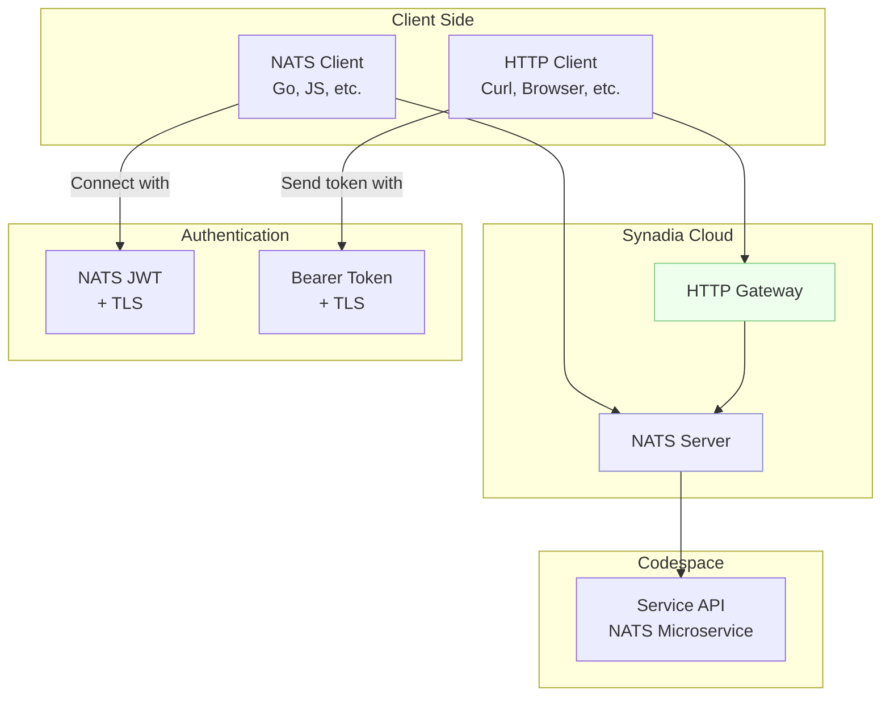
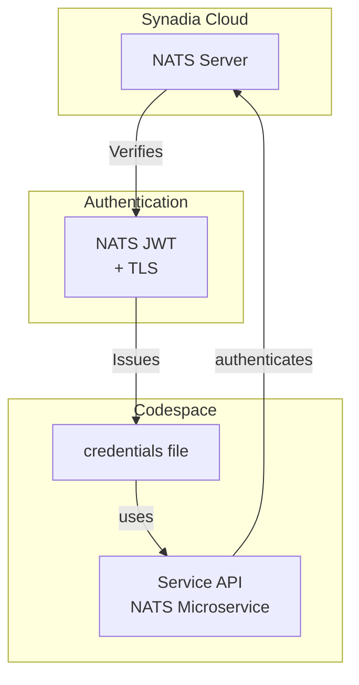

# API Layer

## Communication Protocol

As discussed in the architecture document our API exposes a JSON based API. It can be accessed over two protocols, NATS or HTTP.

- NATS is our preferred protocol. It's high performance, and ideal for system integration because it offers great security, low latency, network failure resiliance, and good scaleability. On the downside, you need to use one of the client libraries, it's less well known than HTTP, and it might be blocked on some corporate firewalls.
- HTTP is the defacto standard protocol for API delivery. It's compatible with standard web infrastructure and has no special client library requirements. However its performance isn't nearly as good as the NATS protocol.  

Our system will be deployed on [Synadia Cloud](https://www.synadia.com/cloud), which offers support for both NATS and HTTP protocols simultaneously.

The access looks something like this:

- A NATS **user** is created for each client/caller.
- NATS Clients authenticate using JWTs issued by the NATS account system, and TLS secures the connection.
- HTTP Clients authenticate by passing a Bearer token, issued by Synadid Cloud, which the HTTP Gateway validates.
- Both paths end up delivering the message to the same NATS microservice, with identity and auth context injected.
- Both connections are **Authorized** the same way.

In turn our microservice itself must make an authenticated connection to NATS, so that API requests can be routed to the service, and responses returned.  Thats configured like this diagram:

- A NATS **user** is created for our Microservice on Synadia Cloud
- When we configure our Microservice,  we copy the **user** credentials file down to our codespace.
- When the Microservice connects to Synadia Cloud (NATS), it passes the credentials which NATS used to **Authenticate** and **Authorize**, sometimes called AuthN/Z.
    - **Authentication** confirms who we are
    - **Authorization** tells the system what we can do. In NATS that means what **subjects** we are allowed to subscribe & publish to.

So for our purposes we need to signup to [Synadia Cloud](https://cloud.synadia.com) and create some **users**.

## Synadia Cloud Authentication and Authorization

First signup to [Synadia Cloud](https://cloud.synadia.com).  They have a free offering which is all we will need for now.

Once you accept the Ts&Cs you are ready to go.  Note there is no need to install the `nats` cli tool becuase we already have that installed inside our codespace.

Our goal is to create two separate NATS **users** and download their credentials.  Credentials are a kind of "secret", and as such, we never want to share them with anyone else, so we can't add them to our git projects. Luckily GitHub codespaces has a feature called Github secrets, that are stored securely against your own personal profile. We have a way of "injecting" Github secrets into our projects.

The process is as follows:

1. Create our secret. In our case its a 'credentials' file created via Synadia Cloud.
2. Encode our secret in [base64](https://en.wikipedia.org/wiki/Base64)
3. Add the base64 encoded secret to [Github codespace user secrets](https://github.com/settings/codespaces)
4. When our codespace starts up, transform the Github codespace user secrets back into a 'credentials' file.

We will repreat this process three times for each of the following NATS user credentials files:

- `CLI` the user that has full access to everything, useful for troubleshooting. Github codespace user secret name `NATS_CREDS_CLI`
- `APP` for the application. Github codespace user secret name `NATS_CREDS_APP`
- `CALLER` for a caller to use. Github codespace user secret name `NATS_CREDS_CALLER`

Use the Synadia website to create a new user. Then click 'Get Connected' and download the credentials file.  Next upload that to your codespace by dragging and dropping the file (or copy and pasing the content). Encode the file using the following command `base64 <path to creds file>` eg: `base64 /workspaces/beaker/NGS-Default-CLI.creds`.  Copy exactly the output, and paste it in as a new [Github codespace user secrets](https://github.com/settings/codespaces) with the the correct name as listed above.

## Validating Request and Responses using JSON Schema

Using [JSON](https://www.json.org/json-en.html) as our data format provides us an industry standard textual based format. JSON support is widespread so we can pretty much guarantee that any language or system will be able to use it. Because its text based, it makes it easier to read and write without needing additional tooling. [Much has been written](http://www.catb.org/esr/writings/taoup/html/textualitychapter.html) on the advantages of text based formats.

What this means for us is that we will need tools to convert to and from JSON from withing our application. Go has [built in support for JSON](https://go.dev/blog/json).

[JSON Schema](https://json-schema.org) adds a layer on top of JSON providing validation and uniformity of the data format that we write in JSON.  We use it to implement validation of inputs and outputs. Incoming calls with invalid inputs are rejected, but we also take the time to validate out outputs so we can guarantee that system responses conforming to its documentation.  Speaking of documentation we use the JSON Schemas to form the API documentation that we share with end users. 

All our schemas are defined in the [schemas](../schemas/) directory. Our deaign has a separate file for API requests and responses.  Where data types are re-used we put them into their own files.

- `inventory-receive` API endpoint is used to add stock.
    - [inventory-receive.request.json](../schemas/inventory-receive.request.json) defines a request
    - [inventory-receive.response.json](../schemas/inventory-receive.response.json) defines a response
- `inventory-drawdown` API endpoint is used to deplete stock.
    - [inventory-drawdown.request.json](../schemas/inventory-drawdown.request.json) defines a request
    - [inventory-drawdown.response.json](../schemas/inventory-drawdown.response.json) defines a response
- `inventory-show` API endpoint is display current stock levels.
    - [inventory-show.request.json](../schemas/inventory-show.request.json) defines a request
    - [inventory-show.response.json](../schemas/inventory-show.response.json) defines a response
- The following shared data types are defined:
    - [product-sku.json](../schemas/product-sku.json) defines the shared data type for a products [stock keeping unit (sku) code](https://en.wikipedia.org/wiki/Stock_keeping_unit)

Eeven though some requests and responses are virtually identical, we model them independently so if they change later we will minimize our impact. When an API changes its a lot of work to make sure no callers are affected. Sometimes you might expose a new version of an API and support calls to both versions simultaneously.