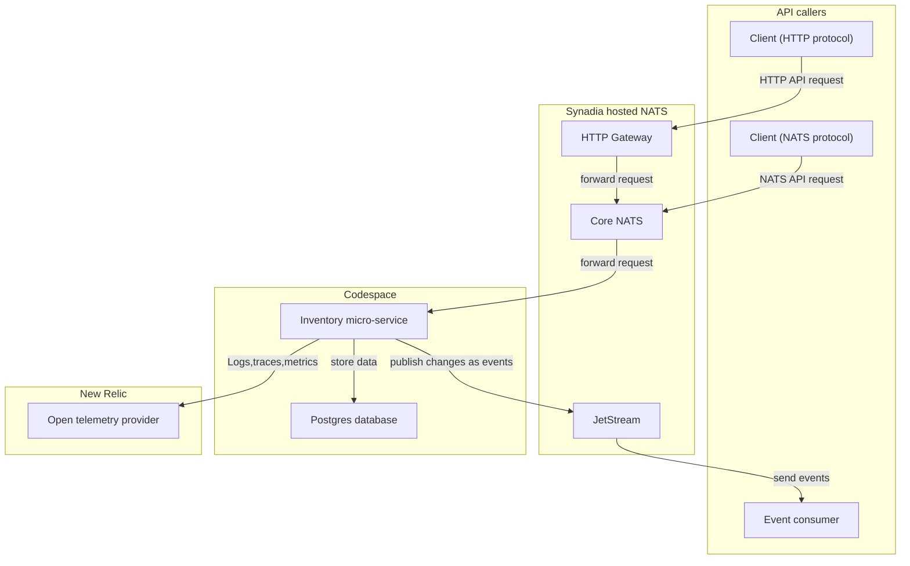
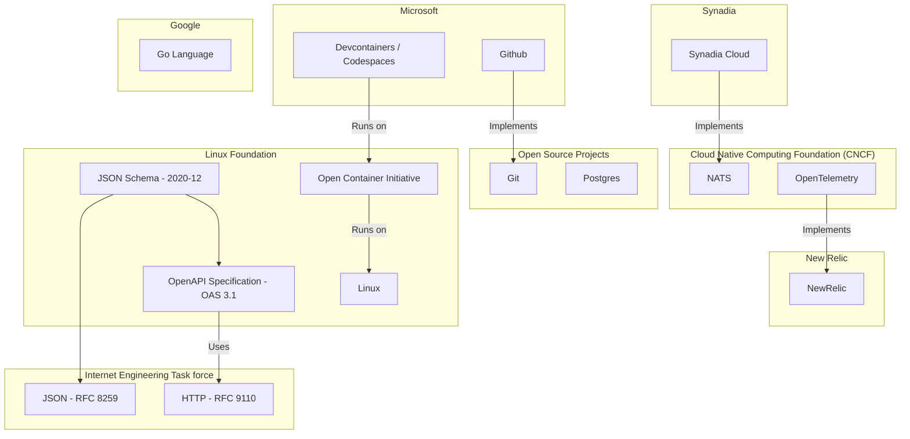

# High-Level Architecture

The system uses a modular microservice approach with NATS as the communication backbone. Each service registers itself using NATS Microservices API and communicates asynchronously via JetStream or synchronously through service requests. The Microservices store data persistently in the Postgres relational database.  We send telemetry information containing real-time behaviour of the system through to the [New Relic](https://newrelic.com) service.

#  System Goals

We are building a basic **Inventory API** that tracks the quantity of products using their unique `product-sku`. The API allows clients to:

- Add stock
- Remove stock
- Query the current stock level

##  Business Rules

- Every product is uniquely identified by a `product-sku`.
- Inventory levels **cannot fall below 0** — we must never sell stock we don’t have.

## API Endpoints

### `stock-add`

- Accepts a `product-sku` and a `quantity`.
- If the product doesn't exist, it is created with a starting quantity of 0.
- The `quantity` is added to the current stock.
- ❌ Rejects if the quantity is `<= 0`.
- Returns the new stock level

### `stock-remove`

- Accepts a `product-sku` and a `quantity`.
- ❌ If the product doesn't exist, return an error and reject the call
- The `quantity` is subtracted from the current stock.
- ❌ Rejects if the result would reduce inventory below 0.
- Returns the new stock level
- If stock level falls below 10, then publish a `low-stock` message

### `stock-get`

- Accepts a `product-sku`.
- Returns the current quantity in stock.
- If the product doesn't exist, returns `0`.

## Technical Requirements

- The API must be accessible via:
  - HTTP
  - NATS
- All requests, responses and events use [JSON](https://www.json.org/json-en.html).
  - Use [JSON Schema](https://json-schema.org/) to validate requests & responses
- Implement tests to verify that our code is working correctly.
- Capture Telemetry using [Open Telemetry](https://opentelemetry.io) standards

# Standards and Organisations

This diagram shows some of the key stanadards that the system is using and dependencies between standards.

