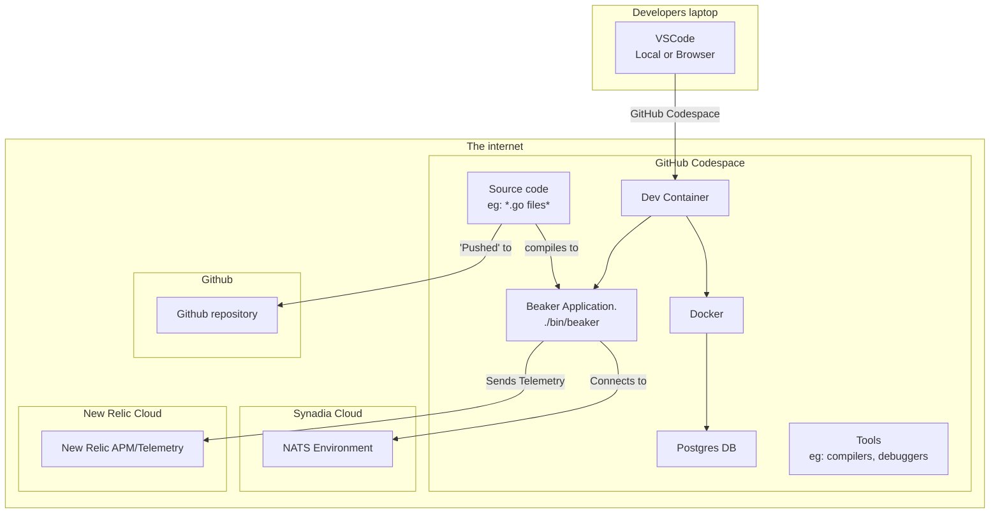

# Development environment

The development environment  where you as software developers write, test, and debug code. It typically includes the tools, configurations, and resources needed to build and run applications safely without affecting the live (production) system.

# Evolution of Development Environments

Development environments have evolved significantly over time. In the 1990s, developers typically connected to remote Unix systems via terminals and serial connections, using tools like vi and gcc. Later, development shifted to local PCs with integrated development environments like Visual Basic and Borland C++, where all tools ran directly on the developer's machine. 

From the 2010s onward, we've seen a return to remote development through cloud-based environments, containerization (Docker, Kubernetes), and web-based IDEs (GitHub Codespaces, GitPod). Modern development environments now emphasize reproducibility, collaboration, and infrastructure-as-code approaches, with tools that seamlessly integrate version control, CI/CD pipelines, and automated testing. The rise of dev containers and virtual development environments ensures consistency across teams while enabling powerful local editing capabilities combined with remote execution.

# Cloud native development environment

Our development environmnet for the `beaker` project looks something like the picture below.

Important notes

- The source code repostory is Github. We pay for them to run this service and manage our code changes for us. It runs remotely.
- Your laptop runs VSCode in a browser window or natively.  This provides the user interface layer only, ie: no files live on your laptop. 
- Each developer runs their own **independent** Github codespace environment, which is a virtual machine running in the cloud that provided a **consistent** development environment. You pay for this service.

## Advantages 

- **Consistency** Developers can choose to run Windows, Mac or Linux, to suit their preferences, but the development environment remains consistent, its actually all running on a standardised unix environment. You can [upgrade this environment](https://docs.github.com/en/codespaces/customizing-your-codespace/changing-the-machine-type-for-your-codespace) for everyone without buying new hardware. 
- **Simplicity** By integrating our development environment with online 'Software as a service' (SaaS) like [Synadia Cloud](https://www.synadia.com/cloud), and [New Relic](https://newrelic.com) we radically simlify our developer setup.  This saves us countless hour of setup and maintenance, installing and configuring software locally. By using cloud service offerings, we know that the software is up to date and this will align with what we will eventually use when we go to production. Note that I could have used an online Postgres database service as well, but for reasons that will become obvious when we talk about testing, I've chosen to run postgres locally.
 
 
## Disadvantages 
 
- **Lack of editor support** forces developers into choosing an editor that supports devcontainers & github codespaces, which generally means choosing [Visual Studio Code](https://code.visualstudio.com) (aka VSCode)
- **Cost** There is a [cost](https://docs.github.com/en/billing/managing-billing-for-your-products/about-billing-for-github-codespaces) associated with codespaces 
- **Speed** SaaS can be a little slower at runtime than running services locally.