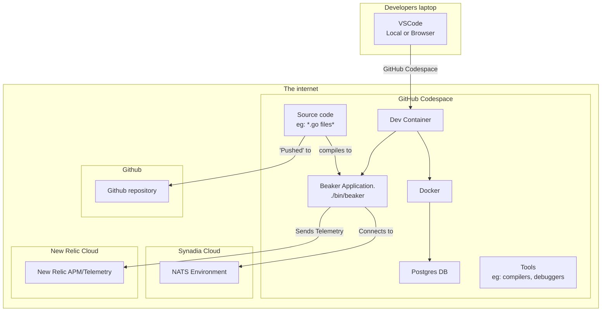

# Development environment

The development environment  where you as software developers write, test, and debug code. It typically includes the tools, configurations, and resources needed to build and run applications safely without affecting the live (production) system.

# Evolution of Development Environments

Development environments have evolved significantly over time. In the 1990s, developers typically connected to remote Unix systems via terminals and serial connections, using tools like vi and gcc. Later, development shifted to local PCs with integrated development environments like Visual Basic and Borland C++, where all tools ran directly on the developer's machine. 

From the 2010s onward, we've seen a return to remote development through cloud-based environments, containerization (Docker, Kubernetes), and web-based IDEs (GitHub Codespaces, GitPod). Modern development environments now emphasize reproducibility, collaboration, and infrastructure-as-code approaches, with tools that seamlessly integrate version control, CI/CD pipelines, and automated testing. The rise of dev containers and virtual development environments ensures consistency across teams while enabling powerful local editing capabilities combined with remote execution.

# Cloud native development environment

Our development environmnet for the `beaker` project looks something like the picture below.

Important notes

- The source code repostory is Github. We pay for them to run this service and manage our code changes for us. It runs remotely.
- Your laptop runs Visual Studio Code (VS Code) in a browser window or natively.  This provides the user interface layer only, ie: no files live on your laptop. 
- Each developer runs their own **independent** Github codespace environment, which is a virtual machine running in the cloud that provided a **consistent** development environment. You pay for this service, but as discussed below it has many benefits.

## Advantages 

- **Consistency** Developers can choose to run Windows, Mac or Linux, to suit their preferences, but the development environment remains consistent, its actually all running on a standardised unix environment. You can [upgrade this environment](https://docs.github.com/en/codespaces/customizing-your-codespace/changing-the-machine-type-for-your-codespace) for everyone without buying new hardware. 
- **Simplicity** By integrating our development environment with online 'Software as a service' (SaaS) like [Synadia Cloud](https://www.synadia.com/cloud), and [New Relic](https://newrelic.com) we radically simlify our developer setup.  This saves us countless hour of setup and maintenance, installing and configuring software locally. By using cloud service offerings, we know that the software is up to date and this will align with what we will eventually use when we go to production. Note that I could have used an online Postgres database service as well, but for reasons that will become obvious when we talk about testing, I've chosen to run postgres locally. In a business scenario, you want your developers to be working on your products, not being stuck configuring their environments.
 
 
## Disadvantages 
 
- **Lack of editor support** forces developers into choosing an editor that supports devcontainers & github codespaces, which generally means choosing [Visual Studio Code](https://code.visualstudio.com) (aka VS Code)
- **Cost** There is a [cost](https://docs.github.com/en/billing/managing-billing-for-your-products/about-billing-for-github-codespaces) associated with codespaces 
- **Speed** SaaS can at times run a little slower at runtime than running services locally, because calls are going across the internet.  The other side of this is that you can scale up use of those services very easily.

# Our dev environment

The [dev-container.json](../.devcontainer/devcontainer.json) contains the configuration for our dev environment.

Lets examine each section in detail.

## `features`

  The `features` section is where we pull in modular, pre-packaged configurations to install and configure common development tools, languages, or utilities. They're designed to be composable, so you can mix and match them to create the exact development environment you need. In our case we install the [`go`](https://go.dev) programming language, and [`docker`](https://www.docker.com) which allows to run Docker containers from inside our codespace.

The [official](https://containers.dev/collections.html) websites lists many more features that cover tools for many programming tasks.

## `forwardPorts`

`forwardPorts` tells the devcontainer to forward access to network ports, allowing you access to them directly from your laptop. Our configuration forwards port `5432` which is used by postgres.

Port forwarding gives us flexibility when accessing networed services.  In my case this means I can run querys using my favorite postgres client [Postico2](https://eggerapps.at/postico2/).

## `customizations`

This section of the `devcontainer.json` file is where vendor specific configuration is kept.

The [VS Code editor](https://code.visualstudio.com) supports `extensions`, which  are small add‑ons or plugins that you can install to extend the functionality of VS Code. They let you customize VS Code to fit your programming language, workflow, and tools. 

Our environment has the following extenstions enabled:

- ["golang.Go"](https://marketplace.visualstudio.com/items?itemName=golang.Go) provides language support for go including a [LSP server](https://en.wikipedia.org/wiki/Language_Server_Protocol) that provides syntax highlighting, code completion and other language specific functions. 
- ["bierner.markdown-mermaid"](https://marketplace.visualstudio.com/items?itemName=bierner.markdown-mermaid) adds [Mermaid](https://mermaid.js.org) diagram and flowchart support to VS Code.  It often helps to visualize systems graphically and Mermaid offers a text based diagramming solution, that supported inside [GitHub](https://github.blog/developer-skills/github/include-diagrams-markdown-files-mermaid/). 

## Lifecycle hooks

Devcontainers have lifecycle 'hooks' that we can use to alter its setiup behaviour:

- The `onCreateCommand` hook runs the [`on_create_command.sh`](./../on_create_command.sh) when the container is built. At that time we install all the tools we need.  
- The `postCreateCommand` hook is run later when the codespace is starting up. At this stage we run the [`post_create_command.sh`](./../post_create_command.sh) to ensure the latest code changes are pulled from the git server, wait for the `docker` server to be ready and then run the services defined in the [`docker-compose.yml`](../.devcontainer/docker-compose.yml) file. 

## Optimizing codespaces through pre-built containers 

Devcontainer startup takes a few seconds because we have [pre-built](https://docs.github.com/en/codespaces/prebuilding-your-codespaces/configuring-prebuilds) the devcontainer which means that all the installation of tools run inside the `onCreateCommand` and precomputed and cached, so staring a new devcontainer only runs the `postCreateCommand`.  This means that creating new development environments is fast which removes a barrier to starting work.