# Open Telemetry

When our application runs we want to examine its runtime behaviour.  We might have a set of business requirements around this:

- To check that its behaving correctly according to our requirements.  Might define [Service Level Agreement](https://en.wikipedia.org/wiki/Service-level_agreement) (SLA) that states "99% of API requests need to return a response in 1s". To determine if we are meeting the SLA we want to measure all our API requests and prove that we are meeting the SLA.
- Record errors and alert staff so action can be taken. For example is we have a bug in our code we want to be alerted to that so we can act on it, and remediate the problem quickly.
- Monitor business bahaviour in real time. For example we might want to know when stock levels fall below a threshold, so the business can order replacement stock.


We might also want to use telemetry to record our own behaviours, for example how long a build takes, or how long it takes to run tests so we can see trends change over time and also constantly evolve our developer tools to maximise our productivity.

To meet our goals we will record traces, and logs inside our application and surrounding tasks to capture the time taken to perform them. If errors occur we have a standard way of recording that so that errors will be easily identifiable.

# Setup with NewRelic

To start with sign up with a free account at [NewRelic](https://newrelic.com/). I chose New Relic just because it is the platform I'm most familiar with but because we are using the [Open Telemetry](https://opentelemetry.io) standard i could have chosen one from a number of [vendors](https://opentelemetry.io/ecosystem/vendors/).

Our application uses the [Open Telemetry 'go' library](https://opentelemetry.io/docs/languages/), which is vendor independent.  The library is configured using configuring environment variables. If you look in the [Makefile](../Makefile) 'run' target you will see that many `OTEL_...` environment variables are used.  The `OTEL_EXPORTER_OTLP_ENDPOINT=https://otlp.nr-data.net` value tells the library to send information through to the New Relic collector URL.  

The next step is to create your own personal [Ingest - Licence Key](https://docs.newrelic.com/docs/apis/intro-apis/new-relic-api-keys/) key in New Relic, that will be used to connect the codespace environment to New Relic.  Follow the [instructions in this link](https://docs.newrelic.com/docs/apis/intro-apis/new-relic-api-keys/) and then follow [these instructions](https://docs.github.com/en/codespaces/managing-your-codespaces/managing-your-account-specific-secrets-for-github-codespaces) to create a new Codespace secret called  `NEW_RELIC_API_KEY` with the 'Ingest - Licence Key' value.

> Note: When you add a codespace secret you will be promoted "Your codespace secrets have changed", so click the "Reload to apply" button to make the secret available.

 Inside the [Makefile](../Makefile), that value is used on the line `OTEL_EXPORTER_OTLP_HEADERS=api-key=${NEW_RELIC_API_KEY}` which tells the Otel library to use that value for authenticating with the New Relic servers.

# Testing NewRelic connectivity

Run the following to create some traces in NewRelic

```bash
make test-otel test-otel-error
```

> Note: It will take a few mins for the traces to become visible in NewRelic

You should see two kinds of "spans" 
- 'curl google' 
- 'test error'

A "span" is like a time-stamped activity log for a single step in a bigger process.
A "trace" is the collection of all those steps showing how a request flowed through a system.

Using the example of a car journey from Wellington to Christchurch as OpenTelemetry Trace

The **whole journey** is a **trace**.  
Each **leg of the journey** is a **span**.

## 📖 Journey Broken Down

| Leg of Trip                   | Span Name               | Start → End Time          | Attributes                         | Events                              |
|--------------------------------|-------------------------|----------------------------|-------------------------------------|-------------------------------------|
| Wellington → Picton (ferry)   | `wellington-picton`     | 7:00 AM → 10:30 AM         | transport: `ferry`, weather: `calm`| delay: “boarding took 30 min”       |
| Picton → Christchurch         | `picton-christchurch`   | 11:00 AM → 5:00 PM         | road: `SH1`, stops: `2`             | event: “lunch in Kaikoura”          |

Each span captures:
- ✅ Start and end times for a leg
- ✅ Metadata (attributes) like road, vehicle, weather
- ✅ Events (delays, errors, stops)

When we translate this to our application, each API call will be a "trace", and each step along the way like validate data, or query database, is a "span".  This will become of great interest to us when we are trying to figure out whats happening inside our app when its running.

In our application we will focus on "traces", but we will also touch on "logs" and "metrics" which are other aspects of Open telementry.

## Production system configuration

Our application sends telemetry information **directly** with the New Relic servers. This might not be appropriate for production, where you might want more control over that information flow.  You might want a setup more like this:

```mermaid
flowchart TD
    A[📱 Application] 
    
    subgraph "Otel Collector"
        B1[🚦 Filter]
        B2[✨ Enrich]
        B3[📊 Aggregate]
        B4[📦 Buffer]
        B5[🎚️ Rate Limit & 🎲 Sample]
        B6[🧽 Sanitize]
        B1 --> B2
        B2 --> B3
        B3 --> B4
        B4 --> B5
        B5 --> B6
    end
    
    A --> B1
    B6 -->|📤 Processed Data| C[🟢 New Relic Backend]
```



As you can see the `otel-collector` provides a level of indirection, that gives us more control.  For example if our API gets ver popular we might need to rate limit and sample the traces because it would cost too much to send them all.  

This reminds us of a well known saying ["All problems in computer science can be solved by another level of indirection."](https://en.wikipedia.org/wiki/David_Wheeler_(computer_scientist)#Quotes).